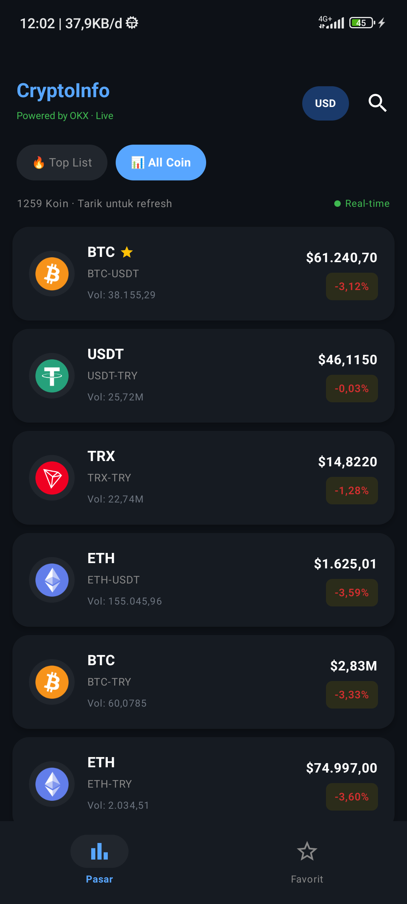
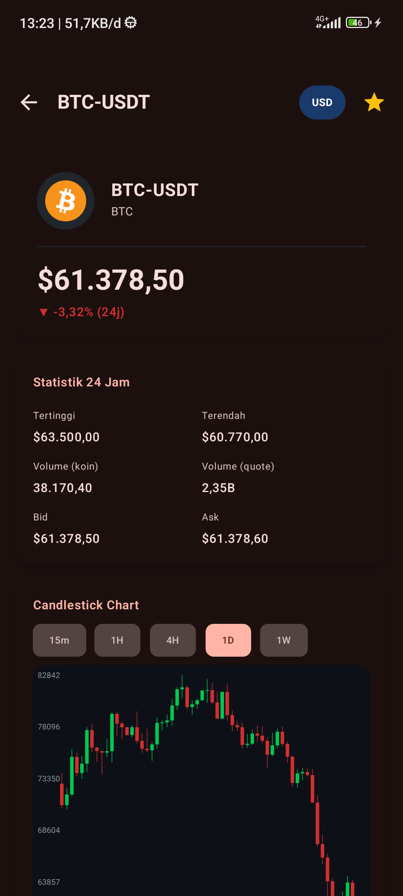
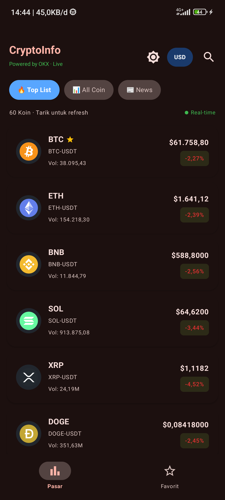
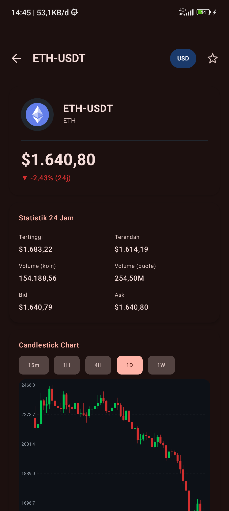

<div align="center">

# 🪙 CryptoInfo

### Real-Time Cryptocurrency Tracker for Android

[](https://kotlinlang.org)
[](https://developer.android.com/jetpack/compose)
[](https://www.okx.com/docs-v5)
[](LICENSE)
[](https://developer.android.com)

**Track 1200+ cryptocurrency pairs in real-time with live WebSocket price feeds, interactive candlestick charts, and a sleek dark-themed UI — all powered by OKX Exchange.**

</div>

---

## ✨ Features

| Feature | Description |
|---------|-------------|
| 📊 **Real-Time Prices** | Live WebSocket-powered ticker updates every second |
| 📰 **Crypto News** | Multi-source news aggregation (CoinDesk, NewsAPI, GNews, etc.) |
| 📖 **In-App Reader** | Modern WebView reader with progress bar, share, and back nav |
| 🔥 **Top List** | Top 60 coins ranked by market capitalization |
| 📈 **All Coins** | Browse 1200+ SPOT trading pairs sorted by volume |
| 🕯️ **Candlestick Charts** | Interactive charts with 5 timeframes (15m, 1H, 4H, 1D, 1W) |
| 💱 **Multi-Currency** | Toggle between USD and IDR (Indonesian Rupiah) |
| ⭐ **Favorites** | Save your watchlist with persistent local storage |
| 🔍 **Search** | Instant search across all trading pairs |
| 🔄 **Pull-to-Refresh** | Swipe down to refresh market data |
| 🛡️ **ISP Bypass** | Built-in DNS bypass for regions with internet restrictions |
| 🌙 **Theme Toggling** | Dynamic Light/Dark mode switching with Material3 Color Scheme |
| ✨ **Shimmer Loading** | Premium skeleton loading animations while fetching data |
| 📌 **Sticky Navigation** | Persistent tab selection and headers while scrolling |
| 🌩️ **Error Handling** | Interactive premium error screens with retry functionality |

---

## 📱 Screenshots

<div align="center">
<table>
<tr>
<td align="center"><b>Top List</b></td>
<td align="center"><b>All Coins</b></td>
<td align="center"><b>Detail & Chart</b></td>
</tr>
<tr>
<td></td>
<td></td>
<td></td>
</tr>
<tr>
<td align="center"><b>Favorites</b></td>
<td align="center"><b>News Tab</b></td>
<td align="center"><b>Article Reader</b></td>
</tr>
<tr>
<td></td>
<td></td>
<td></td>
</tr>
</table>
</div>

---

## 🏗️ Architecture

```
📦 com.santoso.tech
├── 📂 data
│   ├── 📂 api          → Retrofit service (OKX REST API)
│   ├── 📂 local        → Room database (favorites)
│   ├── 📂 model         → Data classes (Ticker, CandleData, etc.)
│   └── 📂 repository    → Repository pattern (Market, Candle, Favorite)
├── 📂 di               → Hilt dependency injection modules
├── 📂 ui
│   ├── 📂 common        → Shared components (CandlestickChart, CoinLogo)
│   ├── 📂 detail        → Coin detail screen & ViewModel
│   ├── 📂 favorite      → Favorites screen & ViewModel
│   ├── 📂 market        → Market list screen & ViewModel
│   └── 📂 theme         → Material3 theming
└── 📂 websocket         → OKX WebSocket manager (real-time feeds)
```

### Design Patterns

- **MVVM** — Clean separation of UI and business logic
- **Repository Pattern** — Unified data access layer
- **Dependency Injection** — Hilt for compile-time DI
- **Reactive Streams** — Kotlin Flow + StateFlow for real-time data
- **Multi-Layer Fallback** — REST API → Instruments API → Hardcoded pairs

---

## 🛠️ Tech Stack

| Category | Technology |
|----------|------------|
| **Language** | Kotlin 2.1 |
| **UI Framework** | Jetpack Compose (Material3) |
| **Architecture** | MVVM + Repository |
| **DI** | Hilt |
| **Networking** | Retrofit + OkHttp |
| **Real-Time** | OKX WebSocket (per-instrument subscription) |
| **Local Storage** | Room Database |
| **Image Loading** | Coil (with SubcomposeAsyncImage fallback) |
| **Serialization** | Kotlinx Serialization |
| **Concurrency** | Kotlin Coroutines + Flow |
| **DNS Bypass** | Custom DNS resolver (Cloudflare IPs) |

---

## 🚀 Getting Started

### Prerequisites

- Android Studio Hedgehog (2023.1.1) or later
- JDK 17
- Android SDK 33+
- An Android device or emulator

### Installation

```bash
# Clone the repository
git clone https://github.com/ekosanto2008/cryptoinfo.git

# Open in Android Studio
# File → Open → select the cloned directory

# Build & Run
./gradlew installDebug
```

### Build from Terminal

```bash
# Debug build
./gradlew assembleDebug

# Install to connected device
./gradlew installDebug
```

---

## 🌐 API Reference

This app uses the **OKX Exchange Public API v5** — no API key required.

| Endpoint | Purpose |
|----------|---------|
| `GET /api/v5/market/tickers` | All SPOT market tickers |
| `GET /api/v5/market/ticker` | Single instrument ticker |
| `GET /api/v5/market/candles` | Candlestick/OHLCV data |
| `GET /api/v5/public/instruments` | Available trading instruments |
| `WSS ws.okx.com:8443/ws/v5/public` | Real-time WebSocket feed |

---

## 🛡️ ISP Bypass (DNS-over-HTTPS)

In certain regions (e.g., Indonesia), ISPs may block access to cryptocurrency exchanges via **DNS poisoning**. CryptoInfo includes a built-in custom DNS resolver that maps OKX domains directly to their Cloudflare IP addresses, bypassing DNS-level censorship without requiring a VPN.

```kotlin
// NetworkModule.kt — Custom DNS resolver
val customDns = object : okhttp3.Dns {
    override fun lookup(hostname: String): List<InetAddress> {
        return when {
            hostname.contains("ws.okx.com") -> listOf(InetAddress.getByName("104.18.43.174"))
            hostname.contains("okx.com") -> listOf(InetAddress.getByName("104.18.23.111"))
            else -> okhttp3.Dns.SYSTEM.lookup(hostname)
        }
    }
}
```

---

## 📄 License

```
MIT License

Copyright (c) 2026 Eko Santoso

Permission is hereby granted, free of charge, to any person obtaining a copy
of this software and associated documentation files (the "Software"), to deal
in the Software without restriction, including without limitation the rights
to use, copy, modify, merge, publish, distribute, sublicense, and/or sell
copies of the Software, and to permit persons to whom the Software is
furnished to do so, subject to the following conditions:

The above copyright notice and this permission notice shall be included in all
copies or substantial portions of the Software.

THE SOFTWARE IS PROVIDED "AS IS", WITHOUT WARRANTY OF ANY KIND, EXPRESS OR
IMPLIED, INCLUDING BUT NOT LIMITED TO THE WARRANTIES OF MERCHANTABILITY,
FITNESS FOR A PARTICULAR PURPOSE AND NONINFRINGEMENT.
```

---

<div align="center">

**Built with ❤️ using Kotlin & Jetpack Compose**

[⬆ Back to top](#-cryptoinfo)

</div>
